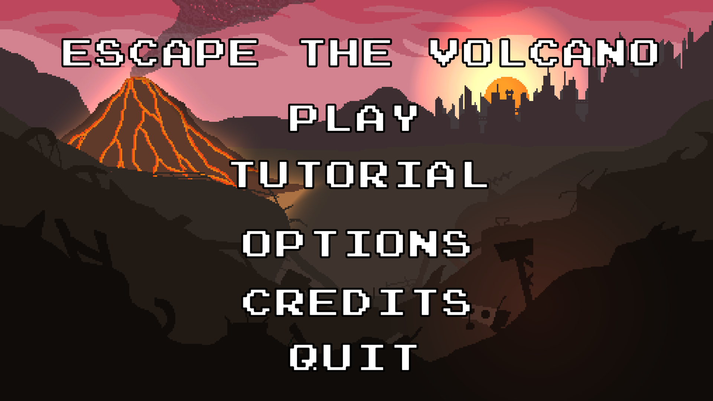
# Escape the volcano
This game has been designed during GameDesign lessons during my first year of master in St-Petersburg.

I decided to code the game because I thought the idea was nice and simple to realize as a first game. It wasn't...

I firstly made it in Python but the engine I coded wasn't optimized enough so a lot of functionnality were not possible. I decided to use an easy tool and more powerfull than python to develop the game, so i turned myself toward Unity.

I learned a lot of things about game design and game developpement in c# and using Unity.

# Get The Game !
Game is available on Windows and Linux !

Go to release and download the latest version of the game.

# Presentation of the game
The goal is to go deep in the dungeon to a treasure room, where you'll need to gather as many crystals as possible in a delimited time. After this looting you'll need to get back to the enter of the dungeon, escaping the lava flow.
You have 3 main keys (besides movement), Action, Fire, Switch

Action allows you to use the power of your class (selected in the selection).
Fire let you use your weapon.
Switch, make you select another robot of your team.

Compose a good team to win the game !

## Choose your team.
First you have to create a team of robbots.
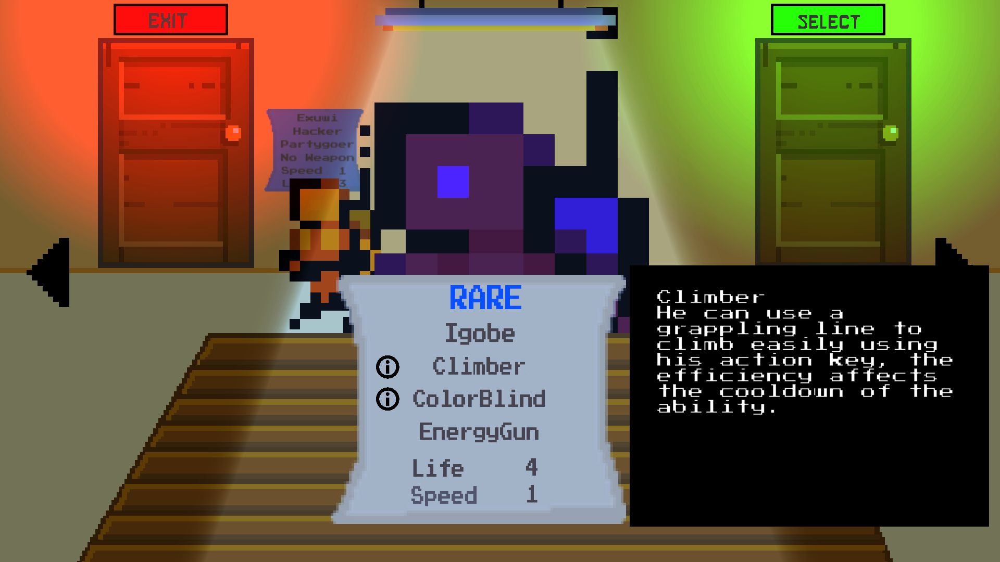

## Discover the random generated level and take your marks.
Dig down into the volcano and take your marks.

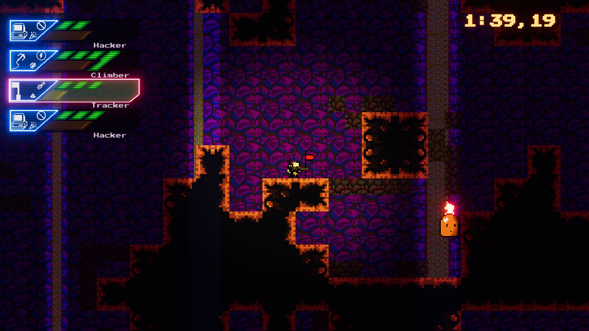

## Loot the tresure.
Get as many loot as possible before lava flows.
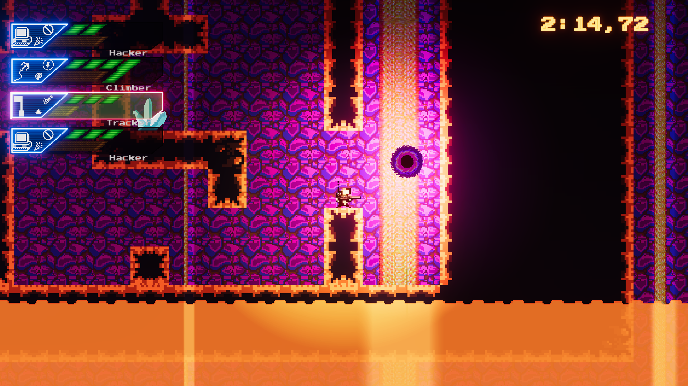

## Escape the volcano before lava kills you.
ESCAAAAAAPE !!
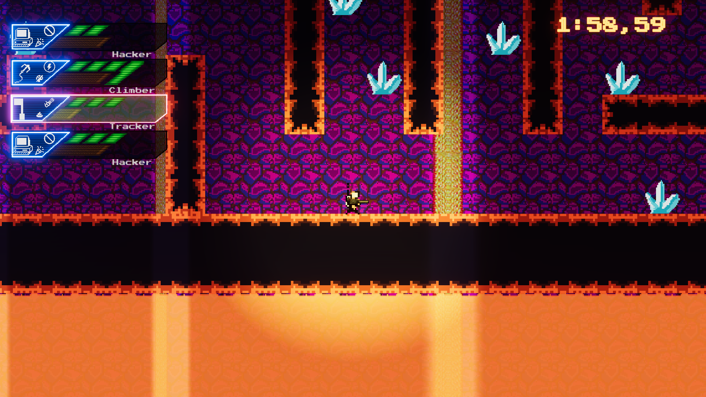

## The game has a score system.
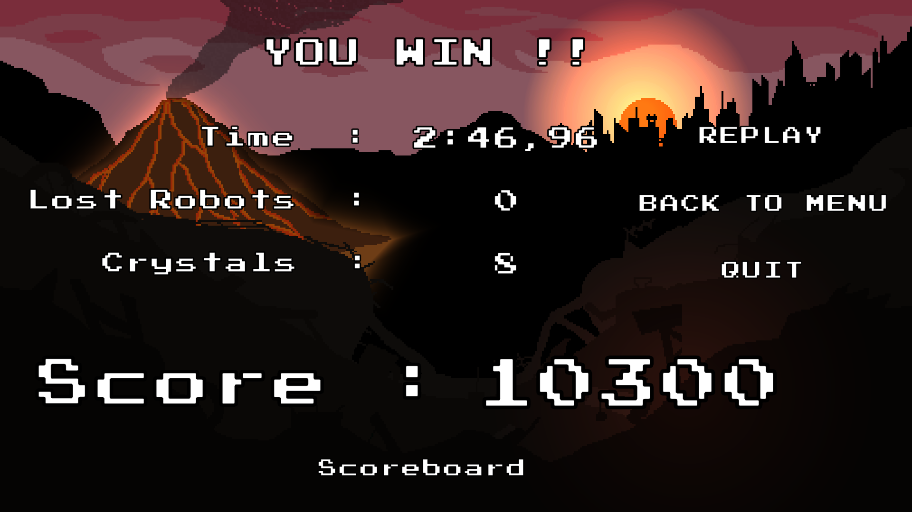

## And a scoreboard !!
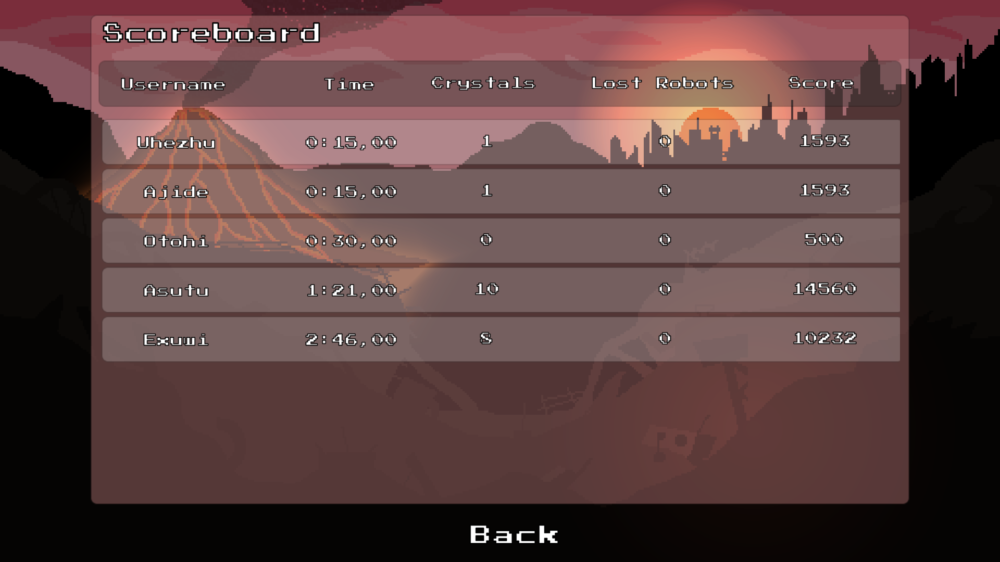

# Class presentation.
## Hacker
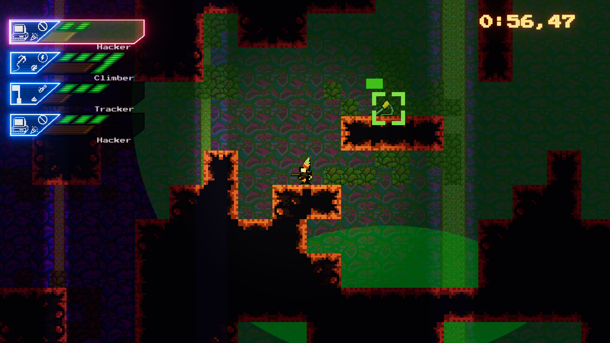

## Climber
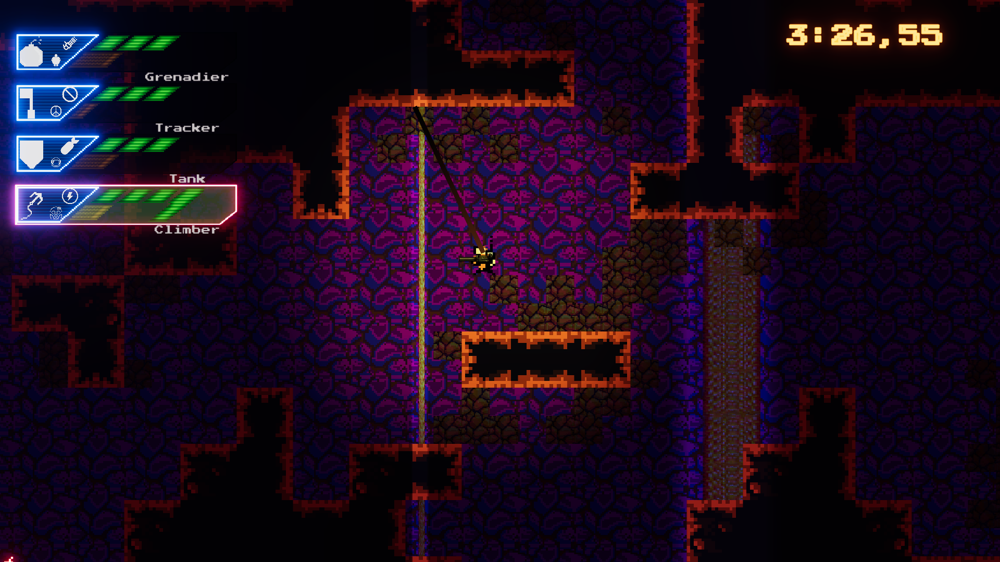

## Runner
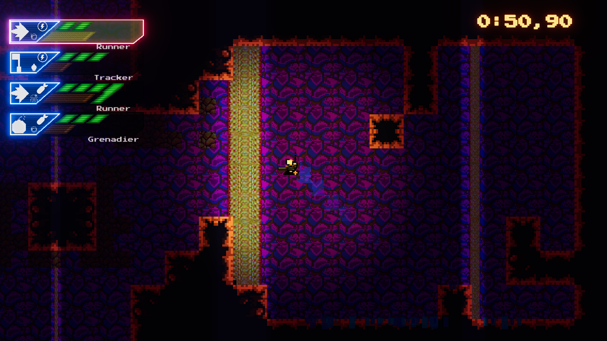

## Tank
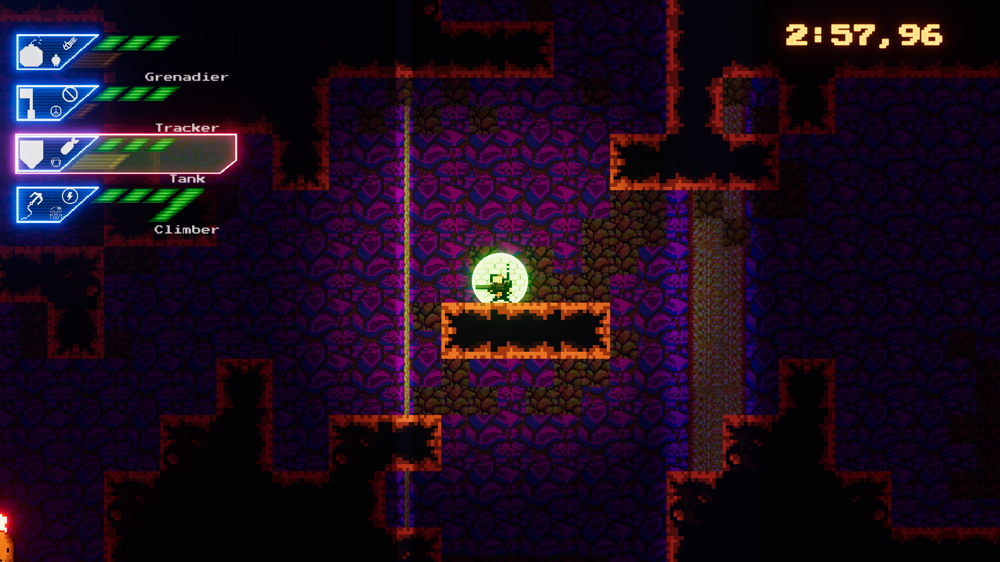

## Grenadier
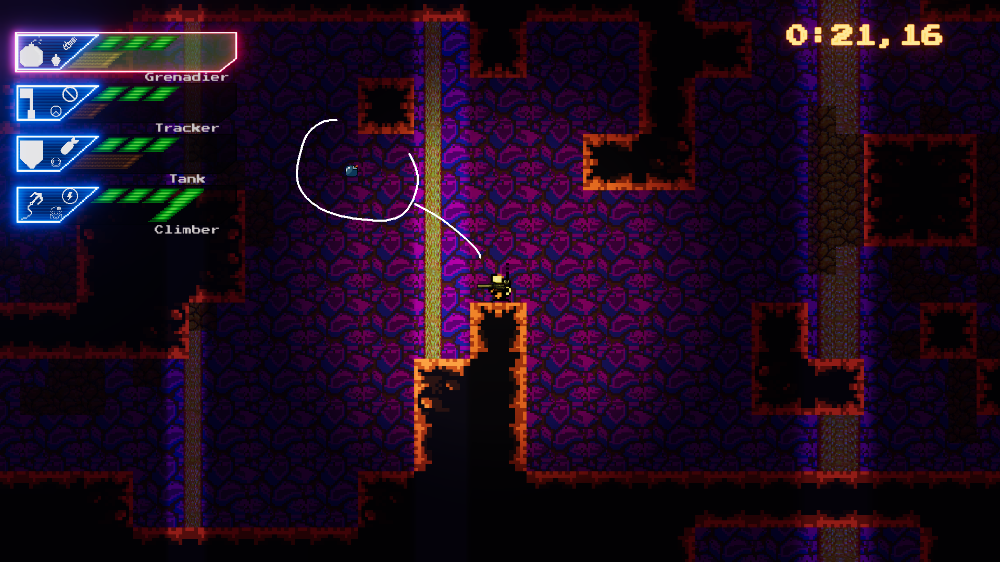

## Tracker

